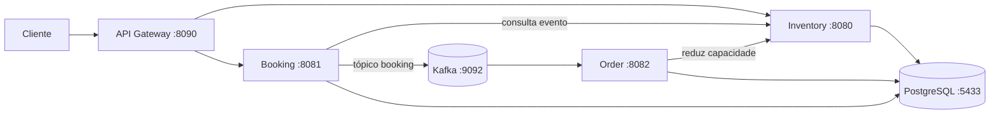

# Event Booking Microservices

Plataforma de reservas de ingressos construída com Java, Spring Boot, PostgreSQL e Apache Kafka. O API Gateway expõe as rotas HTTP; a criação de uma reserva publica um evento no Kafka, consumido pelo serviço de pedidos para registrar o pedido e reduzir a capacidade disponível.

## Arquitetura



| Serviço | Responsabilidade | Porta |
| --- | --- | ---: |
| `api-gateway` | Roteamento das APIs com Spring Cloud Gateway MVC | 8090 |
| `inventory-service` | Consulta de eventos e locais; atualização atômica da capacidade; migrações Flyway | 8080 |
| `booking-service` | Validação da reserva e publicação do evento no Kafka | 8081 |
| `order-service` | Consumo do evento, persistência do pedido e atualização do inventário | 8082 |

O `docker-compose.yml` sobe PostgreSQL, Kafka e Zookeeper. Os quatro serviços Java são executados no host. Todos usam o mesmo banco PostgreSQL; o `inventory-service` aplica as migrações antes dos outros serviços iniciarem.

## Requisitos

- JDK 21 ou superior, com `JAVA_HOME` configurado;
- Docker com Docker Compose;
- Maven Wrapper incluído em cada serviço (`./mvnw`).

## Executar localmente

1. Crie a configuração local e defina uma senha própria, mantendo `POSTGRES_PASSWORD` e `SPRING_DATASOURCE_PASSWORD` iguais:

   ```bash
   cp inventory-service/.env.example inventory-service/.env
   ```

   O exemplo usa a porta **5433** para o PostgreSQL. Se alterá-la, atualize também `SPRING_DATASOURCE_URL`. O arquivo `.env` é ignorado pelo Git.

2. Inicie a infraestrutura:

   ```bash
   cd inventory-service
   docker compose up -d
   docker compose ps
   cd ..
   ```

3. Em **cada terminal** usado para um serviço, carregue as variáveis a partir da raiz do projeto:

   ```bash
   set -a
   source inventory-service/.env
   set +a
   ```

4. Execute cada comando em um terminal separado, aguardando o `inventory-service` iniciar primeiro para aplicar as migrações:

   ```bash
   cd inventory-service && ./mvnw spring-boot:run
   cd booking-service && ./mvnw spring-boot:run
   cd order-service && ./mvnw spring-boot:run
   cd api-gateway && ./mvnw spring-boot:run
   ```

   Os comandos acima são independentes: execute **uma linha por terminal**, sempre a partir da raiz do projeto após carregar o `.env`.

## API

Use `http://localhost:8090` como endereço base para as chamadas externas.

| Método | Rota | Resultado |
| --- | --- | --- |
| `GET` | `/api/v1/inventory/events` | Lista de eventos e capacidade disponível |
| `GET` | `/api/v1/inventory/event/{eventId}` | Evento, local, capacidade e preço |
| `GET` | `/api/v1/inventory/venue/{venueId}` | Dados do local |
| `PUT` | `/api/v1/inventory/event/{eventId}/capacity/{ticketCount}` | Redução da capacidade |
| `POST` | `/api/v1/booking` | Criação de reserva e publicação no Kafka |

Exemplo de reserva:

```bash
curl -X POST http://localhost:8090/api/v1/booking \
  -H 'Content-Type: application/json' \
  -d '{"userId":900001,"eventId":900001,"ticketCount":2}'
```

O banco começa sem eventos e clientes. Para executar o exemplo acima, crie dados locais de demonstração:

```bash
cd inventory-service
docker compose exec -T postgres sh -c 'psql -U "$POSTGRES_USER" -d "$POSTGRES_DB"' <<'SQL'
INSERT INTO venue (id, name, address, total_capacity)
VALUES (900001, 'Arena Demo', 'Porto Alegre', 100);
INSERT INTO event (id, name, address, total_capacity, left_capacity, venue_id, ticket_price)
VALUES (900001, 'Evento Demo', 'Porto Alegre', 100, 100, 900001, 25.00);
INSERT INTO customer (id, name, email)
VALUES (900001, 'Cliente Demo', 'demo-900001@example.invalid');
SQL
```

Depois da reserva, consulte `GET /api/v1/inventory/event/900001` para verificar a redução da capacidade. O pedido é criado de forma assíncrona pelo `order-service`.

Documentação OpenAPI: [Inventory pelo gateway](http://localhost:8090/docs/inventoryservice/v3/api-docs) e [Booking](http://localhost:8081/swagger-ui.html).

## Testes

Com o PostgreSQL e o Kafka ativos e as variáveis do `.env` carregadas no terminal, execute os testes existentes em cada módulo:

```bash
for service in inventory-service booking-service order-service api-gateway; do
  (cd "$service" && ./mvnw test) || break
done
```

Para encerrar a infraestrutura, execute `docker compose down` dentro de `inventory-service`. Esse comando preserva o volume do PostgreSQL.
